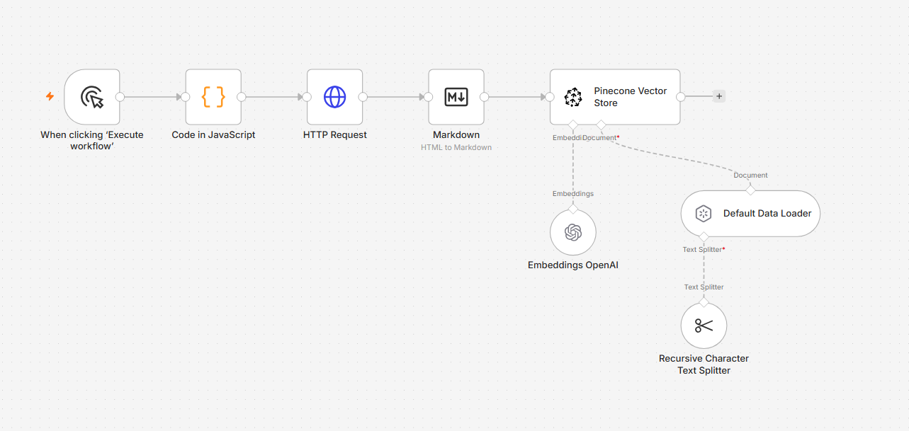
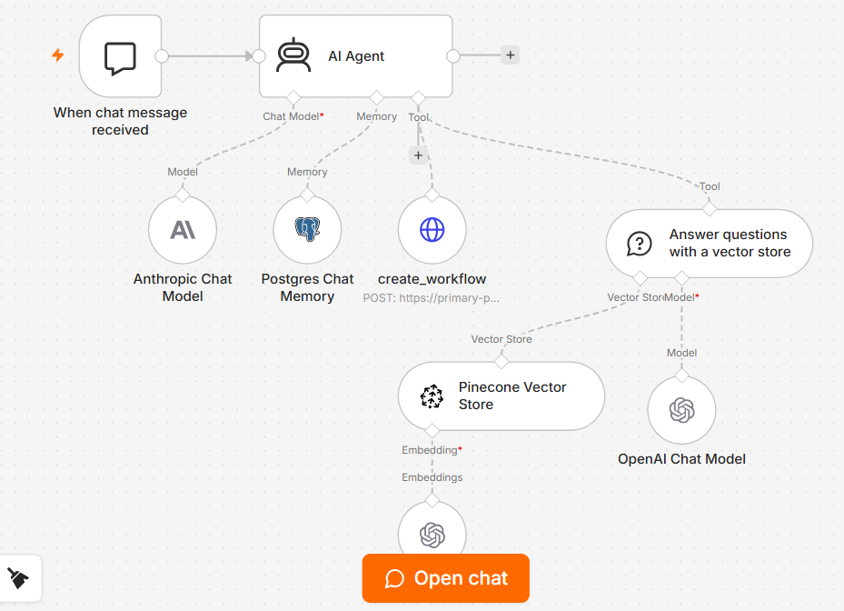
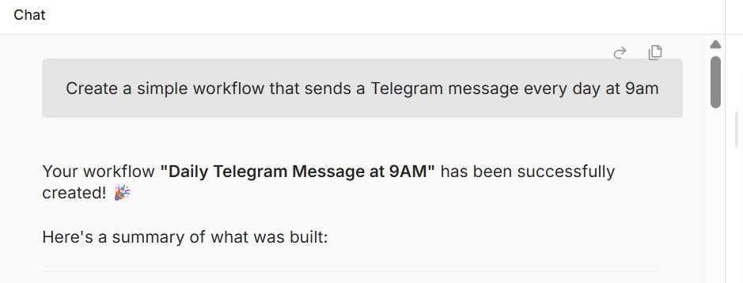
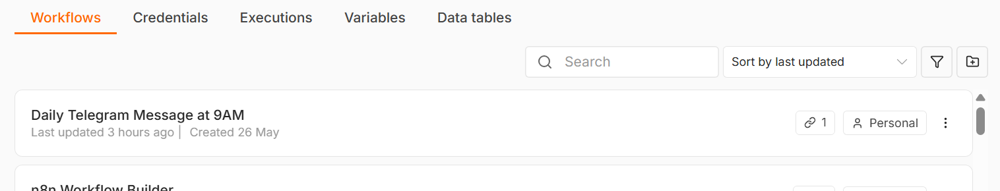

# n8n Workflow Builder — AI Agent

An AI-powered agent that generates and deploys n8n workflows automatically from plain language descriptions. Built with Claude Sonnet, Pinecone RAG, and the n8n API.

---

## 📌 Overview

Describe a workflow in natural language and the agent will:
1. Look up the relevant n8n nodes in the official documentation (via RAG)
2. Generate a valid n8n workflow JSON
3. Deploy it directly to your n8n instance via API — no manual steps required

---

## 🏗️ Architecture

### Workflow 1 — Documentation Ingestion

```
Manual Trigger → Code (URL list) → HTTP Request → 
Markdown converter → Pinecone Vector Store
                           ↑                ↑
                   Embeddings OpenAI   Default Data Loader
                                             ↑
                                 Recursive Character Text Splitter
```



- Scrapes 5 sections of the official n8n documentation
- Converts HTML to clean Markdown
- Chunks and embeds content with `text-embedding-ada-002`
- Stores 670 vectors in Pinecone under the `n8n-docs` namespace

### Workflow 2 — AI Agent (Workflow Builder)

```
When Chat Message Received → AI Agent
                                 ↑              ↑           ↑
                      Claude Sonnet 4.6   Postgres     Vector Store
                                          Memory       QA Tool
                                                          ↑
                                                   Pinecone (n8n docs)
                                                   + create_workflow tool
                                                     (n8n API POST)
```



- Hosted chat interface
- Agent consults RAG before generating any workflow
- Deploys workflows automatically via n8n REST API
- Conversation memory persisted in PostgreSQL

---

## 📸 Demo



*Input:* "Create a simple workflow that sends a Telegram message every day at 9am"

*Output:* Workflow automatically created and live in n8n



---

## 🛠️ Tech Stack

| Tool | Role |
|---|---|
| [n8n](https://n8n.io) | Workflow automation + deployment target |
| [Anthropic Claude Sonnet 4.6](https://anthropic.com) | AI Agent brain |
| [Pinecone](https://pinecone.io) | Vector database for n8n docs RAG |
| [OpenAI](https://openai.com) | Embeddings (`text-embedding-ada-002`) + RAG retrieval (`gpt-4o`) |
| [PostgreSQL](https://postgresql.org) | Conversation memory |
| Railway | n8n hosting |
| n8n REST API | Automated workflow deployment |

---

## ⚙️ Setup

### Prerequisites

- n8n instance (self-hosted or Railway)
- Anthropic API key
- OpenAI API key
- Pinecone account
- PostgreSQL database
- n8n API key (Settings → API)

### Pinecone Index Configuration

- **Index name:** `n8n-docs`
- **Dimensions:** `1536`
- **Metric:** `cosine`
- **Namespace:** `n8n-docs`

### Steps

1. Clone this repository
2. Import both workflows from the `/workflows` folder into n8n
3. Run **Workflow 1** once to scrape and index the n8n documentation
4. Configure credentials in **Workflow 2**:
   - Anthropic API key
   - OpenAI API key
   - Pinecone API key
   - PostgreSQL connection
   - n8n API key (Header Auth: `X-N8N-API-KEY`)
5. Update the n8n API URL to your instance
6. Publish Workflow 2 and open the chat

---

## 💬 Example Prompts

- `Create a workflow that sends a Telegram message every day at 9am`
- `Build a workflow that reads Gmail and sends a Slack summary`
- `Create a webhook workflow that saves data to Google Sheets`

---

## 📁 Repository Structure

```
n8n-workflow-builder/
├── README.md
└── workflows/
    ├── n8n_docs_to_pinecone.json
    └── n8n_workflow_builder.json
```

---

## 📄 License

This project is for portfolio and educational purposes.
